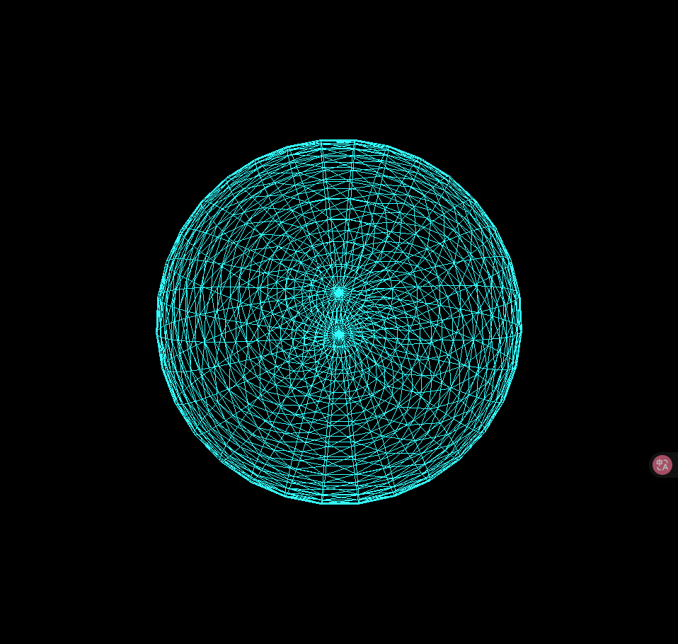

# yton0999_9103_tut9

## Question 1
The neon and wireframe-style visuals in Blade Runner 2049 and Cyberpunk 2077 left a strong impression on me and inspired my reinterpretation of Nasreen Mohamedi’s Untitled-1. I plan to incorporate glowing contour lines and a high-contrast color palette—especially cyan, magenta, and deep purple—to enhance visual depth and a futuristic feel. This imaging technique transforms simple lines into dynamic, sci-fi compositions, effectively meeting the assignment’s goals of interactivity and stylistic innovation.

## Question 2
I found a Three.js code example on GitHub that uses MeshBasicMaterial with both wireframe and emissive properties to render a glowing neon sphere. The code also applies continuous rotation to the object using the requestAnimationFrame() loop, creating a smooth animation effect. This technique simulates a futuristic, holographic wireframe look by combining real-time rendering with neon-colored edges, specifically cyan. The visual dynamic closely aligns with my cyberpunk concept, as it enhances spatial depth, visual motion, and immersive atmosphere. I plan to apply this technique to transform static lines into animated.

[neon sphere](https://gist.github.com/shopglobal/fab7d7b632f489c35475790310e3ddd1)

